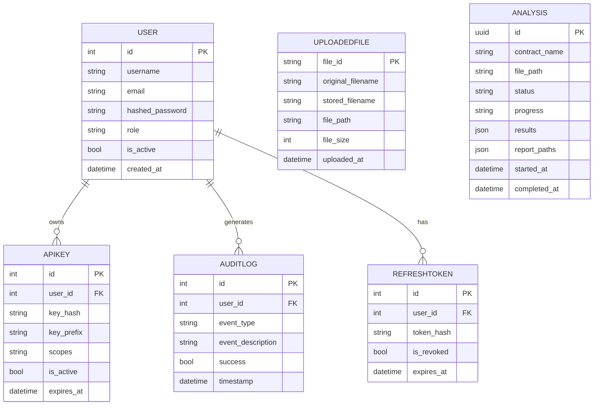
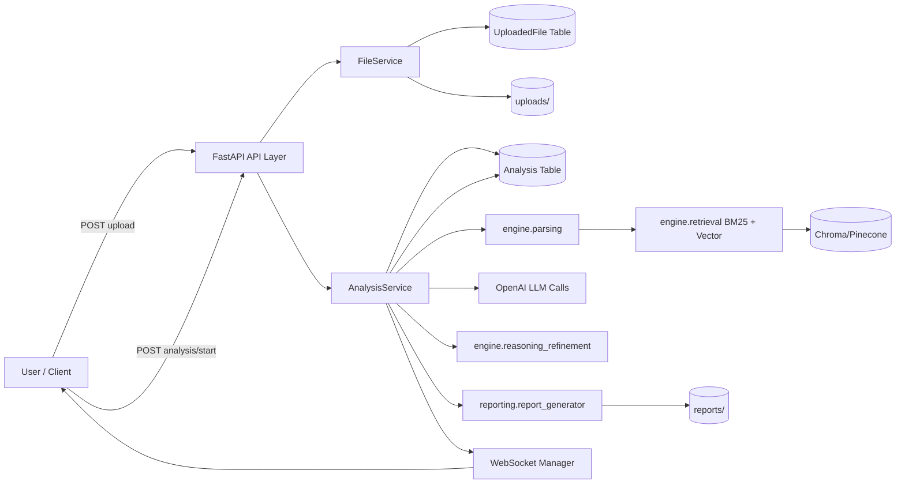
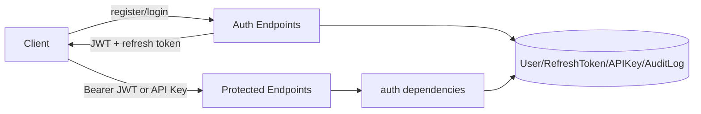
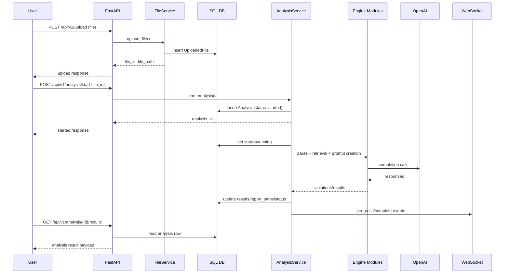
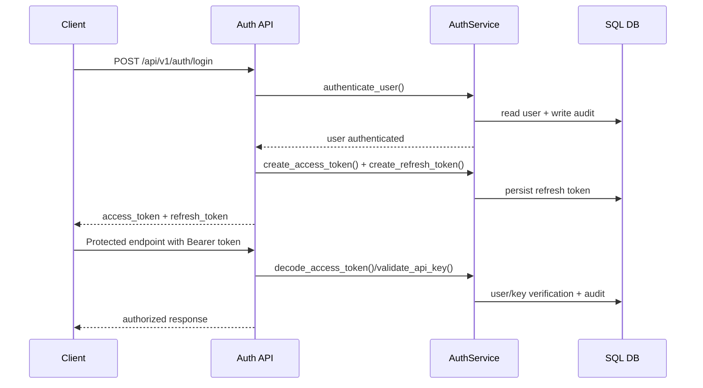
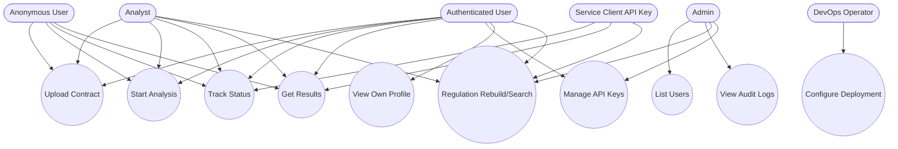

# 04 — System Diagrams (ERD, Data Flow, Sequence, Use Case)

## ERD (Core Persistent Entities)

---

## Data Flow Diagram — Contract Analysis

---

## Data Flow Diagram — Auth and Access

---

## Sequence Diagram — Upload + Analyze + Result

---

## Sequence Diagram — Auth Login + API Access

---

## Use Case Diagram (Functional)

